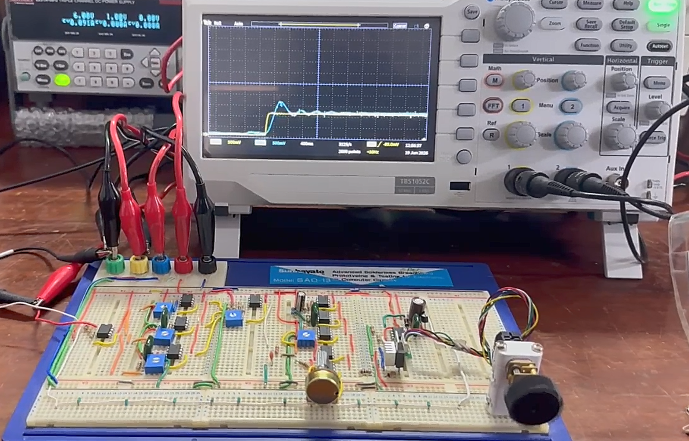
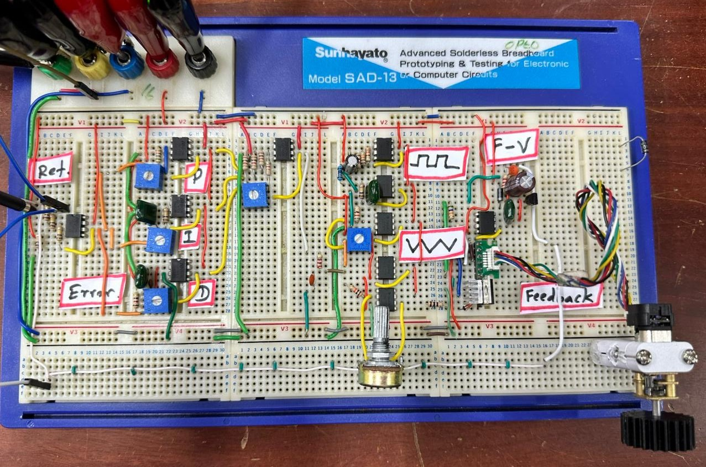
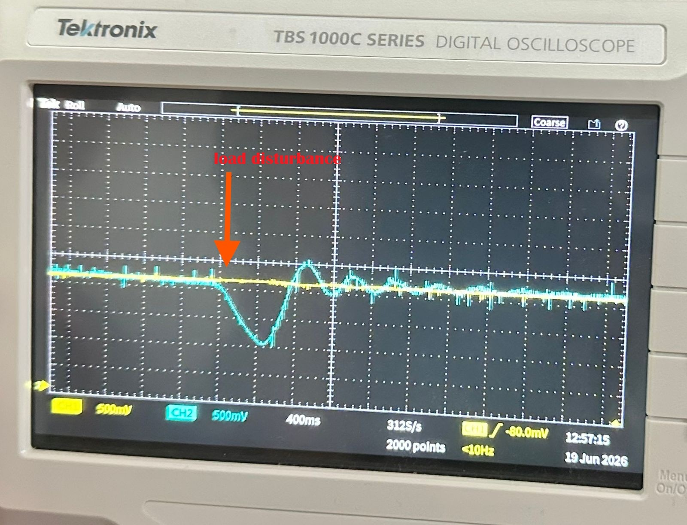
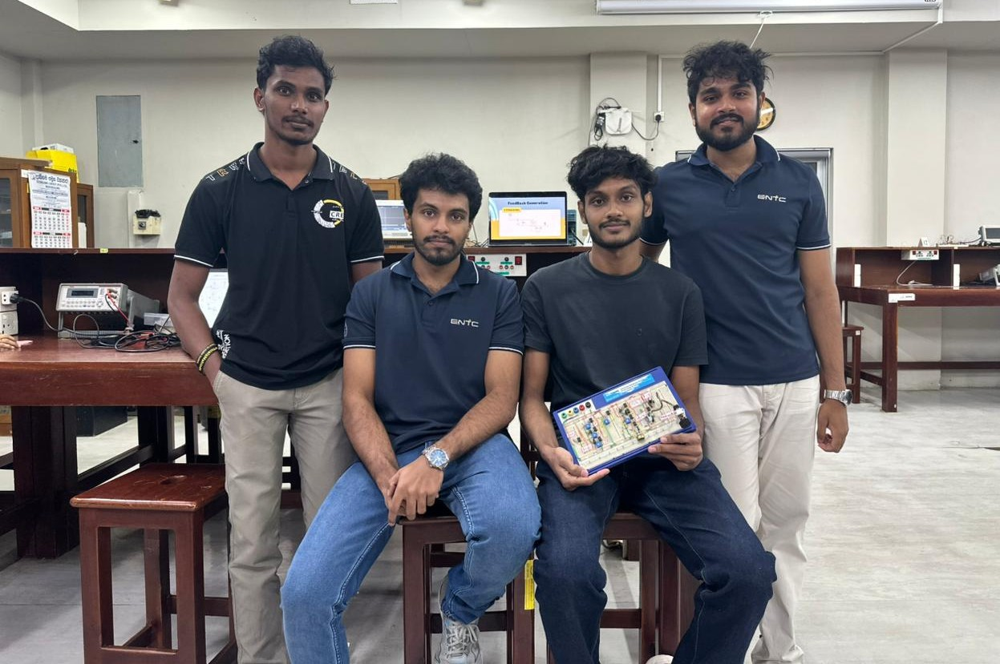

# Analog PID Motor Speed Controller

  

  

  

  

An analog closed-loop DC motor speed controller designed using operational amplifiers, PWM generation, and encoder-based feedback. The system maintains a desired motor speed under varying load conditions by continuously adjusting the motor drive signal using a PID control algorithm implemented entirely in analog hardware.

## Overview

This project was developed as part of the EN2111 – Electronic Circuit Design module at the Department of Electronic and Telecommunication Engineering, University of Moratuwa.

The controller measures motor speed using a magnetic encoder, converts the encoder frequency into a proportional voltage, and compares it with a user-defined reference speed. The resulting error signal is processed by proportional, integral, and derivative control stages to generate a PWM signal that drives the motor.

## Features

- Analog PID controller implementation
- Closed-loop speed control
- Encoder-based speed feedback
- Frequency-to-Voltage (F-V) conversion
- PWM motor control
- Mechanical disturbance rejection
- Adjustable speed reference
- Real-time error correction
- Breadboard implementation and testing

## System Architecture

Reference Speed
↓
Error Generator
↓
PID Controller (P + I + D)
↓
PWM Generator
↓
Motor Driver
↓
DC Motor
↑
Encoder Feedback
↑
Frequency-to-Voltage Converter

## Hardware Components

- N20 DC Motor with Magnetic Encoder
- TL071 Operational Amplifiers
- LM741 Operational Amplifiers
- L293D Motor Driver
- IN914 Diodes
- Resistors and Capacitors
- Potentiometers for PID tuning
- Dual ±12 V Power Supply
- 6 V Motor Supply

## Functional Blocks

### Feedback Generation

The motor encoder generates pulses proportional to shaft speed. A Frequency-to-Voltage converter transforms the pulse frequency into a DC voltage representing the actual motor speed.

### PID Controller

The PID controller minimizes the difference between desired and measured speed using:

- Proportional Control (P)
- Integral Control (I)
- Derivative Control (D)

Control law:

u(t) = Kp·e(t) + Ki∫e(t)dt + Kd(de(t)/dt)

### PWM Generation

A triangular waveform generator and comparator are used to generate a PWM signal whose duty cycle is proportional to the PID controller output.

### Motor Driver

The PWM signal drives the motor through an L293D motor driver, providing sufficient current capability and isolation from the control circuitry.

## Testing

The system was evaluated using:

### Step Response Test

Sudden changes in reference speed were applied to evaluate transient response, settling time, and stability.

### Mechanical Disturbance Test

External load disturbances were applied to the motor shaft to verify the controller's disturbance rejection capability and speed recovery performance.

## Results

- Stable closed-loop operation
- Reduced steady-state error
- Fast speed recovery after disturbances
- Effective load compensation
- Smooth speed regulation

## Future Improvements

- Kalman filter based feedback enhancement
- Automatic PID parameter tuning
- Bidirectional motor control
- Higher efficiency motor driver stage
- Digital monitoring and data logging
- Hybrid analog-digital control implementation

## Demonstration

The project demonstration includes:

- Step Response Analysis
- Mechanical Disturbance Rejection Test
- Closed-Loop Speed Regulation

## Authors

Group 13

Department of Electronic and Telecommunication Engineering  
University of Moratuwa  
Sri Lanka

## License

This project is intended for educational and academic purposes.
